# SpecWeft 产品与技术规划

## 1. 产品定位

SpecWeft 是 Codex、Claude Code、Cursor 等 AI Coding Agent 的本地伴侣层。

它不替代 Coding Agent，不负责自己写代码。它负责：

- 根据项目和需求推荐合适的 MCP
- 根据项目和需求推荐合适的 Skills
- 管理项目级 AI 配置
- 记录 AI 修改过程
- 解释 AI 写完后的代码改动
- 生成 review checklist
- 保存需求线程记忆
- 在新线程中恢复历史上下文

一句话：

```text
SpecWeft is the memory, review, and configuration layer for AI-assisted development.
```

中文：

```text
SpecWeft 是 AI 开发过程中的“规范与上下文编织层”。
它把需求、项目规范、MCP、Skills、AI 修改记录和 review 结果串起来，让开发者能看懂、追溯并恢复 AI 编程上下文。
```

## 2. 核心痛点

目标用户已经在使用 Codex、Claude Code、Cursor、Cline、Roo Code 等工具。

他们的问题不是“没有 AI 写代码”，而是：

1. 不知道当前项目该配哪些 MCP
2. 不知道当前项目该启用哪些 Skills
3. 不想手动找 MCP、找 Skills、填配置
4. AI 写完代码后看不懂它为什么这么改
5. 需求大时，AI 容易过度封装，导致代码更难 review
6. 新开线程后，上一个需求上下文很难继承
7. 多个需求并行时，很难找回某个历史需求的修改记录
8. AI 修改记录缺少可追溯性，无法快速回看当时的决策

SpecWeft 的目标是：

```text
让 AI 写代码后的结果可理解、可 review、可恢复、可追溯。
```

## 3. 产品原则

### 3.1 不做新的 Coding Agent

SpecWeft 不做：

- 自动写代码
- 多模型协作
- 任务编排框架
- Codex / Claude Code 平替

### 3.2 做嵌入式增强层

用户仍然使用原工具：

- Codex
- Claude Code
- Cursor
- Cline
- Roo Code

SpecWeft 提供：

- CLI
- 本地 Web UI
- MCP Server
- 本地存储
- Diff Review
- Session Recall
- MCP/Skill 推荐与配置

### 3.3 本地优先

默认所有数据保存在本地：

- 项目画像
- MCP registry
- Skill registry
- 项目启用配置
- 代码 diff 摘要
- 会话摘要
- 需求关键词
- review 报告

### 3.4 用户可控

第一版只做：

```text
自动推荐 + 一键应用到项目配置
```

不自动修改用户全局 Claude/Codex/Cursor 配置。

涉及权限的操作必须展示原因和风险。

## 4. 产品形态

第一版做 npm 工具：

```bash
npx specweft init
npx specweft start
```

提供：

```text
CLI + Local Web UI + MCP Server
```

后期再扩展：

- 桌面版
- VS Code 插件
- GitHub PR 集成
- 团队空间

## 5. Pool 与装配设计

MCP 和 Skills 是不同概念，不能混到一个 `tools.json`。

SpecWeft 的核心模型应该分四层：

```text
MCP Pool          -> 全局 MCP 池，存 MCP manifest / endpoint / launch 信息
Skill Pool        -> 全局 Skills 池，存 Skill 本体和索引
Project Selection -> 当前项目选择启用哪些 MCP / Skills
Runtime Assembly  -> 给 Codex / Claude 临时组装上下文和配置
```

### 5.1 全局 MCP Pool

位置：

```text
~/.specweft/mcp/
  registry.json
  manifests/
    filesystem.json
    github.json
    browser.json
```

作用：

```text
记录所有已知 MCP Server 的索引和 manifest。
```

`registry.json` 示例：

```json
{
  "version": 1,
  "items": [
    {
      "id": "filesystem",
      "name": "Filesystem MCP",
      "manifestPath": "~/.specweft/mcp/manifests/filesystem.json",
      "source": "builtin"
    }
  ]
}
```

单个 MCP manifest 示例：

```json
{
  "id": "filesystem",
  "name": "Filesystem MCP",
  "description": "Read and write files in allowed directories.",
  "runtime": "stdio",
  "launch": {
    "command": "npx",
    "args": ["-y", "@modelcontextprotocol/server-filesystem", "{{projectRoot}}"]
  },
  "permissions": ["filesystem"],
  "risk": "medium",
  "tags": ["files", "context", "local"]
}
```

远程 MCP manifest 示例：

```json
{
  "id": "linear",
  "name": "Linear MCP",
  "description": "Remote MCP endpoint for Linear issues.",
  "runtime": "remote",
  "url": "https://mcp.example.com/linear",
  "auth": {
    "type": "env",
    "env": ["LINEAR_API_KEY"]
  },
  "permissions": ["network"],
  "risk": "medium",
  "tags": ["issues", "project-management"]
}
```

说明：

```text
MCP Pool 不一定存 MCP 本体。
MCP 本体可能是 npm 包、Python 包、Docker 镜像、本地二进制或远程服务。
SpecWeft 第一版只存 manifest，也就是“怎么连接、怎么启动、需要什么权限”。
```

### 5.3 当前已实现的基础闭环

截至当前版本，SpecWeft 已经打通这些基础能力：

- 项目扫描：生成 `.specweft/profile.json`
- 全局 MCP Pool：写入 `~/.specweft/mcp/registry.json` 和 manifests
- 全局 Skill Pool：写入 `~/.specweft/skills/registry.json` 和 `SKILL.md`
- 项目选择：写入 `.specweft/mcp.json` 和 `.specweft/skills.json`，支持 list / enable / disable / ignore
- Runtime Assembly：把项目选择转换成 agent 可读取的 MCP/Skill 配置
- MCP Inspect：输出 Claude/Codex 可用的 MCP client config 和工具清单
- Review Report：把当前 diff 转成 `.specweft/reports/*.md`
- Session Memory：把 review 摘要写入 `.specweft/memory.json`，默认保留 7 天
- MCP Server：让 Claude/Codex 通过 MCP 工具读取项目画像、装配配置、review、recall，并应用 MCP/Skill
- Web UI：提供项目画像、工具推荐、项目选择、runtime assembly、review、recall、MCP 接入配置的本地控制台

### 5.2 全局 Skill Pool

位置：

```text
~/.specweft/skills/
  registry.json
  diff-explainer/
    SKILL.md
    examples/
  test-planner/
    SKILL.md
```

作用：

```text
记录所有可复用 Skills 的索引和本体。
```

`registry.json` 示例：

```json
{
  "version": 1,
  "items": [
    {
      "id": "diff-explainer",
      "name": "Diff Explainer",
      "description": "Explain AI-generated code changes and produce review checklist.",
      "source": "builtin",
      "skillPath": "~/.specweft/skills/diff-explainer/SKILL.md",
      "tags": ["review", "diff", "coding-agent"],
      "risk": "low"
    }
  ]
}
```

Skill 本体示例：

```text
~/.specweft/skills/diff-explainer/
  SKILL.md
  examples/
  scripts/
```

说明：

```text
Skills 可以由 SpecWeft 管理本体。
不同项目不会复制一份 Skill，只在项目选择文件中引用 Skill id。
```

### 5.3 项目 MCP 选择

位置：

```text
.specweft/mcp.json
```

作用：

```text
记录当前项目启用、禁用、忽略了哪些 MCP。
```

示例：

```json
{
  "version": 1,
  "selected": [
    {
      "id": "filesystem",
      "status": "enabled",
      "reason": "Needed for repository context and diff review.",
      "appliedAt": "2026-05-21T00:00:00Z"
    },
    {
      "id": "database",
      "status": "ignored",
      "reason": "Not needed for current frontend project.",
      "appliedAt": "2026-05-21T00:00:00Z"
    }
  ]
}
```

### 5.4 项目 Skill 选择

位置：

```text
.specweft/skills.json
```

作用：

```text
记录当前项目启用、禁用、忽略了哪些 Skills。
```

示例：

```json
{
  "version": 1,
  "selected": [
    {
      "id": "diff-explainer",
      "status": "enabled",
      "reason": "Used after each AI-generated code change.",
      "appliedAt": "2026-05-21T00:00:00Z"
    },
    {
      "id": "test-planner",
      "status": "enabled",
      "reason": "Suggests tests based on changed files.",
      "appliedAt": "2026-05-21T00:00:00Z"
    }
  ]
}
```

### 5.5 项目画像

位置：

```text
.specweft/profile.json
```

作用：

```text
记录项目本身是什么类型。
```

包含：

- project id
- project name
- root path
- languages
- frameworks
- package manager
- test commands
- build commands
- rule files

### 5.6 Session Memory

短期先放：

```text
.specweft/memory.json
```

后续迁移到：

```text
~/.specweft/specweft.db
```

默认 TTL：

```text
7 days
```

### 5.7 Runtime Assembly

Runtime Assembly 是 SpecWeft 的核心价值之一。

它负责把：

```text
全局 MCP Pool
全局 Skill Pool
项目 MCP 选择
项目 Skill 选择
项目 Profile
当前任务
```

组装成 Codex / Claude 可以使用的运行时上下文。

正确流程：

```text
读取 ~/.specweft/mcp/registry.json
读取 ~/.specweft/mcp/manifests/*
读取 ~/.specweft/skills/registry.json
读取 ~/.specweft/skills/*/SKILL.md
读取项目 profile
读取项目 .specweft/mcp.json
读取项目 .specweft/skills.json
根据当前任务和启用状态组装运行时上下文
提供给 Codex / Claude / MCP Server
```

Assembly 输出示例：

```json
{
  "mcpServers": {
    "filesystem": {
      "command": "npx",
      "args": [
        "-y",
        "@modelcontextprotocol/server-filesystem",
        "/Users/blockcloth/Developer/specweft"
      ]
    }
  },
  "skills": [
    {
      "id": "diff-explainer",
      "path": "~/.specweft/skills/diff-explainer/SKILL.md"
    }
  ]
}
```

## 6. 总体架构

```mermaid
flowchart TB
    User["Developer"]

    subgraph Agents["Coding Agents"]
        Codex["Codex"]
        Claude["Claude Code"]
        Cursor["Cursor"]
        Cline["Cline / Roo Code"]
    end

    subgraph Package["specweft npm package"]
        CLI["CLI\ninit/status/recommend/review/recall"]
        Web["Local Web UI\nMCP / Skills / Memory / Review"]
        API["Local API Server"]
        MCPServer["SpecWeft MCP Server"]
    end

    subgraph Core["Core Engine"]
        Scanner["Project Scanner"]
        Recommender["MCP & Skill Recommender"]
        Registry["Pool Registry Manager"]
        Selection["Project Selection Manager"]
        Assembler["Runtime Assembly"]
        Diff["Diff Analyzer"]
        Explainer["Change Explainer"]
        Memory["Session Memory"]
        Recall["Context Recall"]
        Policy["Policy Checker"]
    end

    subgraph LocalProject["Project .specweft"]
        Profile["profile.json"]
        ProjectMcp["mcp.json"]
        ProjectSkills["skills.json"]
        ProjectMemory["memory.json"]
        Reports["reports/"]
    end

    subgraph GlobalHome["~/.specweft"]
        McpPool["mcp/registry.json + manifests/"]
        SkillPool["skills/registry.json + skill dirs"]
        DB["specweft.db later"]
    end

    User --> CLI
    User --> Web
    User --> Codex
    User --> Claude
    User --> Cursor
    User --> Cline

    CLI --> Core
    Web --> API
    API --> Core
    Codex --> MCPServer
    Claude --> MCPServer
    Cursor --> MCPServer
    MCPServer --> Core

    Scanner --> Profile
    Recommender --> Registry
    Registry --> McpPool
    Registry --> SkillPool
    Selection --> ProjectMcp
    Selection --> ProjectSkills
    Assembler --> Registry
    Assembler --> Selection
    Assembler --> Profile

    Diff --> Reports
    Memory --> ProjectMemory
    Recall --> ProjectMemory
```



## 7. 核心模块

### 7.1 Project Scanner

职责：

- 扫描项目
- 生成 `.specweft/profile.json`
- 识别语言、框架、包管理器、测试命令、规则文件

### 7.2 Pool Registry Manager

职责：

- 管理全局 MCP Pool
- 管理全局 Skill Pool
- 初始化 builtin MCP manifest
- 初始化 builtin Skill 本体
- 后续支持 marketplace sync

### 7.3 MCP & Skill Recommender

职责：

- 从 MCP Pool 中挑选适合当前项目的 MCP
- 从 Skill Pool 中挑选适合当前项目的 Skills
- 输出推荐原因和风险等级
- 第一版使用规则
- 后续可加入 LLM 辅助推荐

### 7.4 Project Selection Manager

职责：

- 写入 `.specweft/mcp.json`
- 写入 `.specweft/skills.json`
- 记录当前项目启用/禁用/忽略状态

### 7.5 Runtime Assembly

职责：

- 读取 MCP Pool
- 读取 Skill Pool
- 读取 project selections
- 读取 project profile
- 替换 `{{projectRoot}}` 等变量
- 根据当前任务组装给 Agent 的 MCP/Skill 上下文

### 7.6 Diff Analyzer

职责：

- 读取 git diff
- 统计改动文件
- 输出 diff summary

### 7.7 Change Explainer

职责：

- 解释 AI 修改了什么
- 解释为什么这样改
- 标记风险点
- 生成 review checklist
- 识别过度封装信号

### 7.8 Session Memory

职责：

- 保存需求线程
- 保存修改摘要
- 保存关键词
- 7 天 TTL

### 7.9 Context Recall

职责：

- 新线程按关键词恢复上下文
- 输出可复制给 Codex / Claude 的 context pack

## 8. CLI 规划

第一阶段：

```bash
specweft init --repo .
specweft status --repo .
specweft recommend --repo .
specweft review --repo .
specweft recall --repo . --keyword "login"
```

第二阶段：

```bash
specweft pool list mcp
specweft pool list skills
specweft apply mcp filesystem
specweft apply skill diff-explainer
specweft assembly --task "fix login bug"
```

第三阶段：

```bash
specweft start
specweft mcp
```

## 9. Web UI 规划

页面：

```text
Dashboard
Project Profile
MCP Registry
Skill Registry
Project MCP Selection
Project Skill Selection
Diff Review
Session Memory
Recall Search
Settings
```

## 10. 技术选型

第一版：

```text
TypeScript
Node.js 20+
pnpm workspace
CLI 手写参数解析，后续换 commander
JSON 文件存储，后续换 SQLite
规则推荐，后续接 marketplace / LLM
```

后续：

```text
Fastify
React + Vite
@modelcontextprotocol/sdk
better-sqlite3
zod
commander
```

## 11. 里程碑

### Phase 0: 项目骨架

已完成：

- monorepo
- core
- cli
- init
- recommend
- review draft
- recall draft

### Phase 1: Status 与文件路径

目标：

- status 输出项目名
- profile 是否存在
- memory 是否存在
- profilePath
- memoryPath
- 当前推荐 MCP 名称
- 当前推荐 Skills 名称

### Phase 2: MCP Pool 与 Skill Pool

目标：

- 创建 `~/.specweft/mcp/registry.json`
- 创建 `~/.specweft/mcp/manifests/*.json`
- 创建 `~/.specweft/skills/registry.json`
- 创建 builtin skills 目录和 `SKILL.md`
- 创建 `.specweft/mcp.json`
- 创建 `.specweft/skills.json`
- status 输出 pool 和 project selection 状态

### Phase 3: Apply Selection

目标：

- `specweft apply mcp <id>`
- `specweft apply skill <id>`
- 写入项目级选择文件

### Phase 4: Runtime Assembly

目标：

- `specweft assembly --repo .`
- 读取全局 MCP Pool
- 读取全局 Skill Pool
- 读取项目 `.specweft/mcp.json`
- 读取项目 `.specweft/skills.json`
- 替换 `{{projectRoot}}`
- 输出 Codex / Claude 可用的运行时配置

### Phase 5: Review Report

目标：

- `specweft review` 输出 Markdown
- 保存到 `.specweft/reports/`

### Phase 6: Session Memory

目标：

- review 后保存 session memory
- recall 输出 context pack

### Phase 7: MCP Server

目标：

- Codex / Claude 可调用：
  - `session_recall`
  - `review_current_diff`
  - `recommend_project_tools`
  - `get_project_profile`

当前第一版已实现：

- `specweft.get_project_profile`
- `specweft.get_runtime_assembly`
- `specweft.review_current_diff`
- `specweft.recall_sessions`

### Phase 8: Web UI

目标：

- 本地 Web 管理 MCP/Skills
- 查看 review 报告
- 搜索 session memory

## 12. 明确不做

第一版不做：

- 自动写代码
- 替代 Codex / Claude
- 多模型编排
- 云同步
- 团队空间
- GitHub App
- VS Code 插件
- 桌面版
- 自动修改所有 Agent 配置

## 13. README 第一屏

```md
# SpecWeft

The memory, review, and configuration layer for AI-assisted development.

SpecWeft helps Codex, Claude Code, Cursor, and MCP-compatible coding agents:

- recommend MCP servers for each project
- recommend Skills for each project
- explain AI-generated code changes
- generate review checklists
- remember coding sessions for 7 days
- restore context in a new agent thread

It does not replace your coding agent. It makes your coding agent easier to configure, understand, review, and resume.
```
